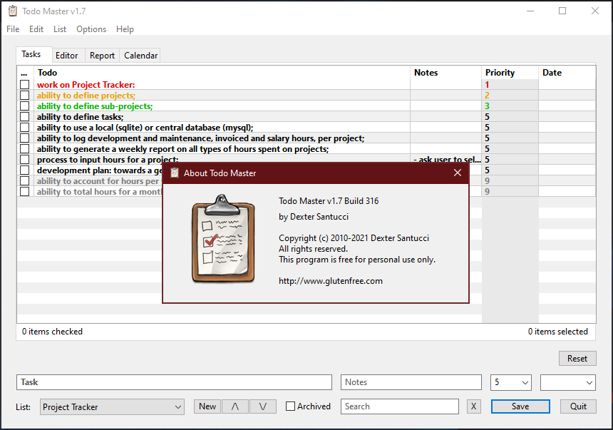
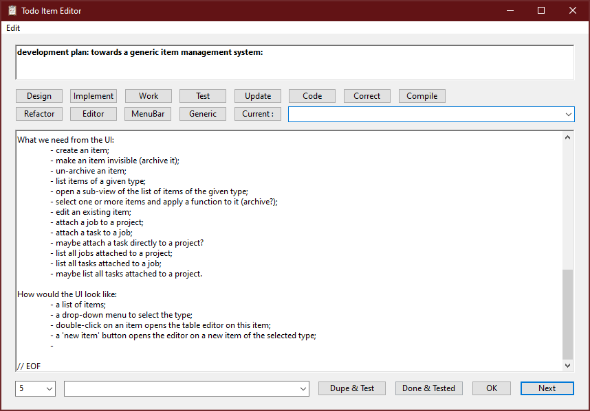
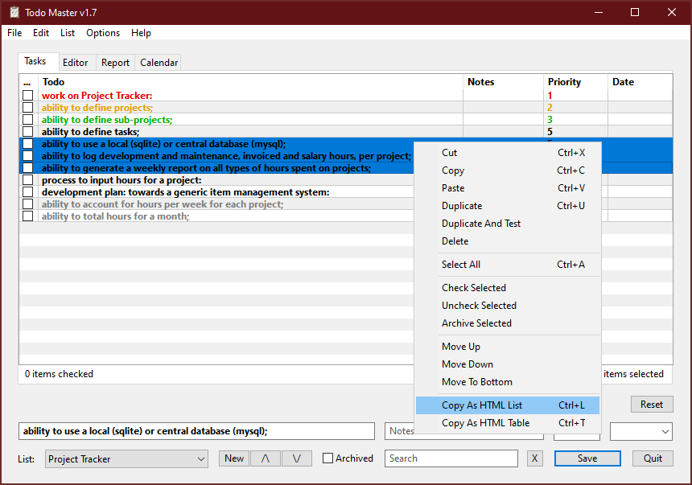
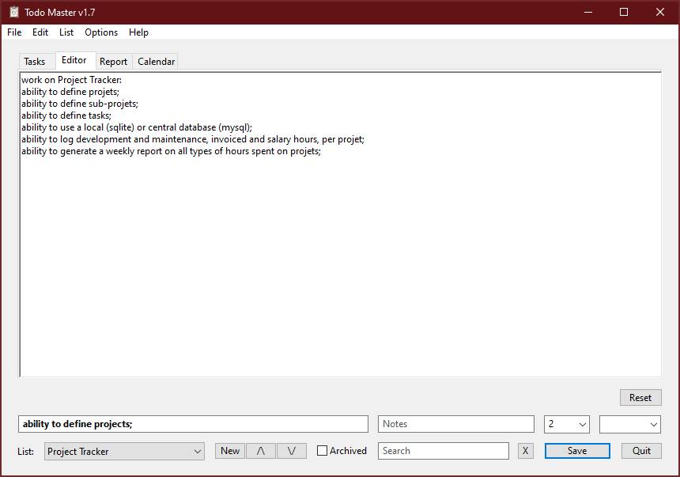
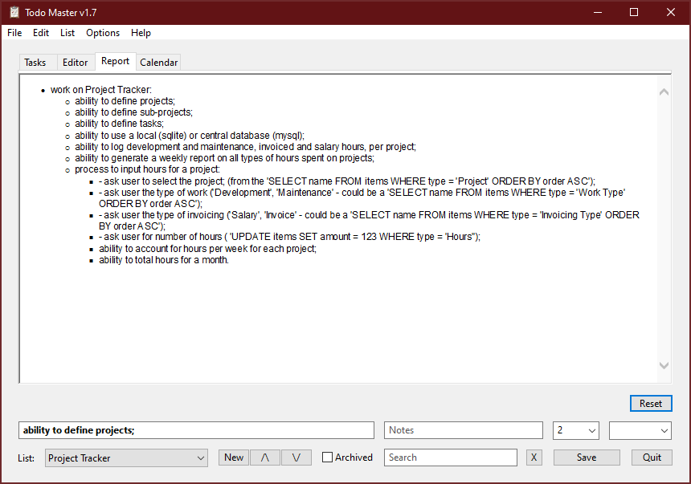
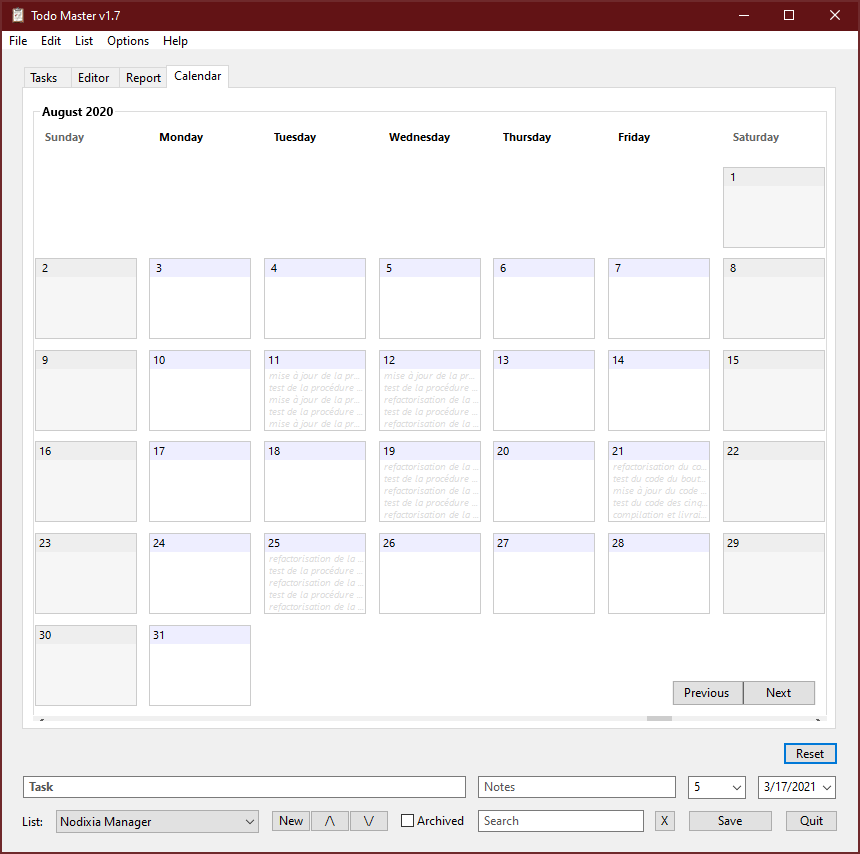

# Todo Master
Todo Master is a programmer's todo list manager with advanced features, such as <b>export to HTML, CSV and Excel</b>, <b>task scheduling</b> with <b>repeat events</b>, <b>calendar</b> and much more.

# Downloads

You can <b>download</b> the latest release for <b>Windows</b> [HERE](https://github.com/DexterLagan/todo-master/releases/tag/v1.7.316).

# Features

The <b>Item Editor</b> lets one create and edit todo items. There are buttons to automate programming key phrases to keep a development log, as well as automatically generate matching test lines. On the same window, the priority and scheduled completion date can also be set. One can also select a week day in the date selector to repeat a task every week:

Several practical functions are hidden in the main menu, replicated in contextual menus available in the list-box. '<b>Export CSV File</b>' is self-explanatory. More specific export types are available in the contextual popup-menu opened on selected items:

The <b>Editor View</b> lets one edit the selected items as plain text. Useful for fixing formatting before exporting to another program:

The <b>Report View</b> outputs the selected and/or checked items as an HTML bullet-point list. This view is mainly used to automatically copy-paste the list to other programs or e-mail. Note that items prefixed with 'Work on' will make all items following it as sub-item in the HTML list.

The <b>Calendar View</b> lets one visualize scheduled items on a calendar. One can also create items on specific days. List items can also be scheduled using date controls on the item editor:

Cheers,

Dexter

